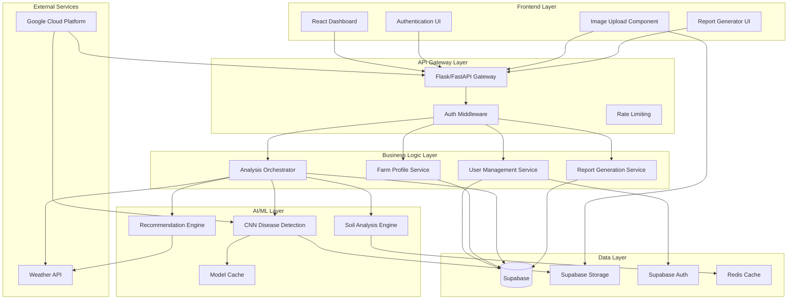

# Design Document: Krushi Mitra

## Overview

Krushi Mitra is a cloud-native AI-powered smart agriculture platform built with a modern web architecture. The system combines React frontend, Python backend APIs, CNN-based AI models, and Supabase cloud services to deliver comprehensive farming intelligence. The platform follows a microservices-inspired architecture with clear separation between presentation, business logic, AI processing, and data management layers.

The design emphasizes scalability, security, and user experience while providing farmers with actionable insights through crop disease detection, soil analysis, and intelligent recommendations. All components are designed for cloud deployment with automatic scaling capabilities.

## Architecture

### System Architecture



### Technology Stack Integration

**Frontend (React + Vite)**
- Modern React 18 with functional components and hooks
- Vite for fast development and optimized builds
- Material-UI or Tailwind CSS for responsive design
- React Query for efficient API state management
- React Router for navigation

**Backend (Python Flask/FastAPI)**
- FastAPI for high-performance async API endpoints
- Pydantic for request/response validation
- SQLAlchemy for database ORM
- Celery for background task processing
- Gunicorn for production WSGI server

**AI/ML Pipeline**
- TensorFlow/PyTorch for CNN model implementation
- OpenCV for image preprocessing
- NumPy/Pandas for data manipulation
- Scikit-learn for additional ML algorithms
- Model versioning and A/B testing capabilities

**Cloud Infrastructure (Google Cloud)**
- Google Cloud Run for containerized API deployment
- Google Cloud Storage for model and image storage
- Google Cloud AI Platform for model training/serving
- Google Cloud Load Balancer for traffic distribution
- Google Cloud Monitoring for observability

## Components and Interfaces

### Frontend Components

**Authentication Module**
```typescript
interface AuthenticationProps {
  onLogin: (credentials: LoginCredentials) => Promise<AuthResult>
  onRegister: (userData: RegistrationData) => Promise<AuthResult>
  onLogout: () => void
}

interface LoginCredentials {
  email: string
  password: string
}

interface RegistrationData {
  email: string
  password: string
  farmName: string
  location: GeoLocation
  cropTypes: string[]
}
```

**Dashboard Component**
```typescript
interface DashboardProps {
  farmData: FarmProfile
  recentAnalyses: AnalysisResult[]
  recommendations: Recommendation[]
  onRefresh: () => void
}

interface FarmProfile {
  id: string
  farmName: string
  location: GeoLocation
  totalArea: number
  cropTypes: CropType[]
  lastUpdated: Date
}
```

**Image Upload Component**
```typescript
interface ImageUploadProps {
  onUpload: (image: File, metadata: ImageMetadata) => Promise<UploadResult>
  acceptedFormats: string[]
  maxFileSize: number
}

interface ImageMetadata {
  cropType: string
  fieldLocation: GeoLocation
  captureDate: Date
  notes?: string
}
```

### Backend API Interfaces

**User Management API**
```python
class UserManagementAPI:
    async def register_user(self, user_data: UserRegistration) -> UserProfile
    async def authenticate_user(self, credentials: LoginCredentials) -> AuthToken
    async def get_user_profile(self, user_id: str) -> UserProfile
    async def update_user_profile(self, user_id: str, updates: ProfileUpdates) -> UserProfile
    async def delete_user_account(self, user_id: str) -> bool
```

**Farm Management API**
```python
class FarmManagementAPI:
    async def create_farm_profile(self, user_id: str, farm_data: FarmData) -> FarmProfile
    async def get_farm_profile(self, farm_id: str) -> FarmProfile
    async def update_farm_profile(self, farm_id: str, updates: FarmUpdates) -> FarmProfile
    async def get_farm_history(self, farm_id: str, date_range: DateRange) -> List[FarmActivity]
```

**Analysis API**
```python
class AnalysisAPI:
    async def analyze_crop_image(self, image_data: ImageData) -> DiseaseAnalysisResult
    async def analyze_soil_data(self, soil_data: SoilParameters) -> SoilAnalysisResult
    async def generate_recommendations(self, analysis_results: List[AnalysisResult]) -> List[Recommendation]
    async def get_analysis_history(self, farm_id: str) -> List[AnalysisResult]
```

### AI/ML Model Interfaces

**Disease Detection Model**
```python
class DiseaseDetectionModel:
    def __init__(self, model_path: str, confidence_threshold: float = 0.7)
    
    async def predict_disease(self, image: np.ndarray) -> DiseaseDetectionResult
    async def batch_predict(self, images: List[np.ndarray]) -> List[DiseaseDetectionResult]
    def get_model_info(self) -> ModelInfo
    
class DiseaseDetectionResult:
    detected_diseases: List[Disease]
    confidence_scores: List[float]
    processed_image: np.ndarray
    processing_time: float
```

**Soil Analysis Engine**
```python
class SoilAnalysisEngine:
    async def analyze_soil_health(self, soil_params: SoilParameters) -> SoilHealthResult
    async def calculate_fertility_index(self, soil_data: SoilData) -> FertilityIndex
    async def recommend_treatments(self, soil_analysis: SoilHealthResult) -> List[Treatment]
    
class SoilParameters:
    ph_level: float
    nitrogen_content: float
    phosphorus_content: float
    potassium_content: float
    organic_matter: float
    moisture_level: float
```

## Data Models

### Core Data Models

**User and Authentication**
```python
class User(BaseModel):
    id: UUID
    email: EmailStr
    password_hash: str
    full_name: str
    phone_number: Optional[str]
    created_at: datetime
    last_login: Optional[datetime]
    is_active: bool = True
    
class AuthToken(BaseModel):
    access_token: str
    refresh_token: str
    token_type: str = "bearer"
    expires_in: int
```

**Farm Management**
```python
class FarmProfile(BaseModel):
    id: UUID
    user_id: UUID
    farm_name: str
    location: GeoLocation
    total_area: float
    crop_types: List[CropType]
    soil_type: str
    irrigation_method: str
    created_at: datetime
    updated_at: datetime
    
class GeoLocation(BaseModel):
    latitude: float
    longitude: float
    address: str
    district: str
    state: str
    
class CropType(BaseModel):
    name: str
    variety: str
    planting_date: date
    expected_harvest: date
    area_allocated: float
```

**Analysis and Results**
```python
class ImageAnalysis(BaseModel):
    id: UUID
    farm_id: UUID
    image_url: str
    crop_type: str
    analysis_date: datetime
    diseases_detected: List[DetectedDisease]
    overall_health_score: float
    recommendations: List[str]
    
class DetectedDisease(BaseModel):
    disease_name: str
    confidence_score: float
    severity_level: str
    affected_area_percentage: float
    treatment_urgency: str
    
class SoilAnalysis(BaseModel):
    id: UUID
    farm_id: UUID
    analysis_date: datetime
    ph_level: float
    nutrient_levels: NutrientLevels
    fertility_index: float
    health_status: str
    recommendations: List[str]
    
class NutrientLevels(BaseModel):
    nitrogen: float
    phosphorus: float
    potassium: float
    organic_matter: float
    micronutrients: Dict[str, float]
```

**Reports and Recommendations**
```python
class AgricultureReport(BaseModel):
    id: UUID
    farm_id: UUID
    report_type: str
    date_range: DateRange
    generated_at: datetime
    content_sections: List[ReportSection]
    file_url: str
    
class ReportSection(BaseModel):
    section_title: str
    content: str
    charts: List[ChartData]
    recommendations: List[str]
    
class Recommendation(BaseModel):
    id: UUID
    farm_id: UUID
    recommendation_type: str
    priority_level: str
    title: str
    description: str
    implementation_steps: List[str]
    expected_outcome: str
    created_at: datetime
    status: str = "pending"
```

### Database Schema Design

**Supabase PostgreSQL Tables**
```sql
-- Users table (managed by Supabase Auth)
CREATE TABLE profiles (
    id UUID REFERENCES auth.users PRIMARY KEY,
    full_name TEXT NOT NULL,
    phone_number TEXT,
    created_at TIMESTAMP WITH TIME ZONE DEFAULT NOW(),
    updated_at TIMESTAMP WITH TIME ZONE DEFAULT NOW()
);

-- Farms table
CREATE TABLE farms (
    id UUID PRIMARY KEY DEFAULT gen_random_uuid(),
    user_id UUID REFERENCES profiles(id) ON DELETE CASCADE,
    farm_name TEXT NOT NULL,
    latitude DECIMAL(10, 8),
    longitude DECIMAL(11, 8),
    address TEXT,
    total_area DECIMAL(10, 2),
    soil_type TEXT,
    created_at TIMESTAMP WITH TIME ZONE DEFAULT NOW(),
    updated_at TIMESTAMP WITH TIME ZONE DEFAULT NOW()
);

-- Crop types table
CREATE TABLE crop_types (
    id UUID PRIMARY KEY DEFAULT gen_random_uuid(),
    farm_id UUID REFERENCES farms(id) ON DELETE CASCADE,
    crop_name TEXT NOT NULL,
    variety TEXT,
    planting_date DATE,
    expected_harvest DATE,
    area_allocated DECIMAL(8, 2)
);

-- Image analyses table
CREATE TABLE image_analyses (
    id UUID PRIMARY KEY DEFAULT gen_random_uuid(),
    farm_id UUID REFERENCES farms(id) ON DELETE CASCADE,
    image_url TEXT NOT NULL,
    crop_type TEXT NOT NULL,
    analysis_results JSONB,
    overall_health_score DECIMAL(3, 2),
    created_at TIMESTAMP WITH TIME ZONE DEFAULT NOW()
);

-- Soil analyses table
CREATE TABLE soil_analyses (
    id UUID PRIMARY KEY DEFAULT gen_random_uuid(),
    farm_id UUID REFERENCES farms(id) ON DELETE CASCADE,
    ph_level DECIMAL(3, 2),
    nutrient_data JSONB,
    fertility_index DECIMAL(3, 2),
    analysis_date TIMESTAMP WITH TIME ZONE DEFAULT NOW()
);
```

## Correctness Properties

*A property is a characteristic or behavior that should hold true across all valid executions of a system—essentially, a formal statement about what the system should do. Properties serve as the bridge between human-readable specifications and machine-verifiable correctness guarantees.*

Based on the requirements analysis, the following correctness properties ensure the system behaves correctly across all valid inputs and scenarios:

### Property 1: Authentication Flow Integrity
*For any* valid user registration data, the user should be able to register successfully and then immediately log in with those same credentials
**Validates: Requirements 1.1, 1.2**

### Property 2: Invalid Authentication Rejection
*For any* invalid credentials (wrong password, non-existent user, malformed input), the authentication system should reject access and return appropriate error messages
**Validates: Requirements 1.3, 1.4**

### Property 3: Session Management
*For any* authenticated user session, after logout, any subsequent requests requiring authentication should be rejected until re-authentication occurs
**Validates: Requirements 1.5**

### Property 4: Farm Profile Data Integrity
*For any* valid farm profile data, creating and then retrieving the profile should return equivalent data with all required fields preserved
**Validates: Requirements 2.1, 2.4**

### Property 5: Profile Update Consistency
*For any* valid profile updates, the updated data should be immediately reflected in subsequent retrievals
**Validates: Requirements 2.2**

### Property 6: Data Isolation
*For any* two different authenticated users, each user should only be able to access their own farm data and never see data belonging to other users
**Validates: Requirements 2.5, 8.3**

### Property 7: Activity History Completeness
*For any* sequence of farm activities (profile updates, analyses, uploads), all activities should be recorded in chronological order and retrievable through history queries
**Validates: Requirements 2.3, 4.5**

### Property 8: Image Analysis Completeness
*For any* valid crop image upload, the disease detection analysis should complete successfully and return results containing disease classifications and confidence scores
**Validates: Requirements 3.1, 3.2**

### Property 9: Invalid Input Rejection
*For any* invalid or corrupted image upload, the system should reject the upload and provide clear error feedback without processing
**Validates: Requirements 3.3**

### Property 10: Disease Ranking Consistency
*For any* analysis result containing multiple detected diseases, the diseases should be ranked in descending order by confidence score
**Validates: Requirements 3.5**

### Property 11: Soil Analysis Validation
*For any* soil parameter input, if the parameters are within valid ranges, analysis should complete and return fertility levels and nutrient content; if invalid, appropriate validation errors should be returned
**Validates: Requirements 4.1, 4.2**

### Property 12: Incomplete Data Handling
*For any* soil analysis request with missing required parameters, the system should identify all missing parameters and request them before proceeding
**Validates: Requirements 4.4**

### Property 13: Recommendation Generation
*For any* completed analysis (crop disease or soil), the system should generate at least one actionable recommendation with priority level and implementation details
**Validates: Requirements 5.1, 5.4**

### Property 14: Recommendation Prioritization
*For any* set of multiple recommendations, they should be ordered by urgency and potential impact, with highest priority recommendations listed first
**Validates: Requirements 5.2**

### Property 15: Context-Aware Recommendations
*For any* recommendation generation, the recommendations should vary appropriately when weather patterns, soil conditions, or crop growth stage inputs change
**Validates: Requirements 5.3**

### Property 16: Dashboard Content Completeness
*For any* authenticated farmer accessing their dashboard, the display should include current farm status, recent analyses, and pending recommendations
**Validates: Requirements 6.1**

### Property 17: Historical Data Processing
*For any* request for historical data, the system should provide trend analysis and comparative insights based on the available historical records
**Validates: Requirements 6.3**

### Property 18: Real-time Updates
*For any* new analysis result, the dashboard should reflect the update and notify the farmer within the current session
**Validates: Requirements 6.5**

### Property 19: Report Content Structure
*For any* generated agriculture report, it should contain all required sections: crop health assessments, soil analysis results, treatment history, and yield predictions
**Validates: Requirements 7.1, 7.2**

### Property 20: Report Customization
*For any* report generation request with specific date ranges or content filters, the generated report should only include data matching those criteria
**Validates: Requirements 7.4**

### Property 21: Report Persistence
*For any* generated report, it should be stored and retrievable through the report history, maintaining the same content and format
**Validates: Requirements 7.5**

### Property 22: PDF Generation Consistency
*For any* report generation request, the output should be a valid PDF document with proper structure and readable content
**Validates: Requirements 7.3**

### Property 23: Authorization Enforcement
*For any* data access request, the system should verify the user is authenticated and authorized to access the specific data before returning results
**Validates: Requirements 8.2**

### Property 24: Data Export and Deletion
*For any* user requesting data export or deletion, the system should provide complete data export or successfully remove all user data while maintaining referential integrity
**Validates: Requirements 8.5**

### Property 25: Image Storage with Metadata
*For any* uploaded crop image, the stored image should retain its metadata including upload date, location, and analysis results, and be retrievable with this metadata intact
**Validates: Requirements 9.1**

### Property 26: Image Organization and Retrieval
*For any* image retrieval request with filters (farm, crop type, date range), the returned images should match the filter criteria and be ordered chronologically
**Validates: Requirements 9.2, 9.3**

### Property 27: Image Compression Quality
*For any* uploaded image, the compressed version should maintain sufficient quality for disease detection analysis while reducing file size
**Validates: Requirements 9.4**

### Property 28: Storage Limit Management
*For any* user approaching storage limits, the system should provide notifications and storage management options before limits are exceeded
**Validates: Requirements 9.5**

### Property 29: Request Queue Management
*For any* AI model processing request, the system should queue the request appropriately and provide status updates until completion
**Validates: Requirements 10.4**

### Property 30: Cache Consistency
*For any* frequently accessed data, cached versions should remain consistent with the source data and be invalidated appropriately when source data changes
**Validates: Requirements 10.5**

## Error Handling

### Error Classification System

**Input Validation Errors**
- Invalid image formats or corrupted files
- Out-of-range soil parameters
- Malformed user registration data
- Invalid authentication credentials

**Business Logic Errors**
- Insufficient data for analysis
- Conflicting farm profile information
- Invalid date ranges for reports
- Unauthorized data access attempts

**System Errors**
- AI model processing failures
- Database connection issues
- External API unavailability
- Storage service interruptions

### Error Response Strategy

**Client-Facing Errors**
```python
class APIError(BaseModel):
    error_code: str
    message: str
    details: Optional[Dict[str, Any]]
    timestamp: datetime
    request_id: str

class ValidationError(APIError):
    field_errors: Dict[str, List[str]]
```

**Error Recovery Mechanisms**
- Automatic retry for transient failures
- Graceful degradation for non-critical features
- Fallback to cached data when external services fail
- User notification for persistent issues

**Logging and Monitoring**
- Structured logging for all errors with context
- Real-time alerting for critical system failures
- Error rate monitoring and trending
- User impact assessment for service degradation

## Testing Strategy

### Dual Testing Approach

The testing strategy employs both unit testing and property-based testing to ensure comprehensive coverage:

**Unit Tests** focus on:
- Specific examples demonstrating correct behavior
- Edge cases and boundary conditions
- Error handling scenarios
- Integration points between components
- Mock external dependencies for isolated testing

**Property-Based Tests** focus on:
- Universal properties that hold across all valid inputs
- Comprehensive input coverage through randomization
- Invariant verification across system operations
- Round-trip properties for data serialization/deserialization
- Metamorphic properties for AI model consistency

### Property-Based Testing Configuration

**Framework Selection**: Hypothesis (Python) for backend property tests, fast-check (TypeScript) for frontend property tests

**Test Configuration**:
- Minimum 100 iterations per property test
- Custom generators for domain-specific data (farm profiles, soil parameters, crop images)
- Shrinking enabled to find minimal failing examples
- Deterministic seeds for reproducible test runs

**Property Test Tagging**:
Each property-based test must include a comment referencing its design document property:
```python
# Feature: krushi-mitra, Property 1: Authentication Flow Integrity
def test_authentication_flow_integrity(user_data):
    # Test implementation
```

**Coverage Requirements**:
- All 30 correctness properties must have corresponding property-based tests
- Unit test coverage minimum 85% for critical business logic
- Integration test coverage for all API endpoints
- End-to-end test coverage for complete user workflows

### Test Data Management

**Synthetic Data Generation**:
- Realistic farm profile generators
- Diverse crop image datasets for AI model testing
- Soil parameter generators covering valid ranges
- User behavior simulation for load testing

**Test Environment Isolation**:
- Separate test databases for each test suite
- Containerized test environments for consistency
- Mock external services (weather APIs, cloud storage)
- Test data cleanup and reset procedures

### Performance Testing

**Load Testing Scenarios**:
- Concurrent user registration and authentication
- Simultaneous image uploads and analysis requests
- Bulk report generation under load
- Database query performance under stress

**AI Model Performance**:
- Image processing time benchmarks
- Model accuracy validation with test datasets
- Memory usage monitoring during batch processing
- Scalability testing for concurrent AI requests